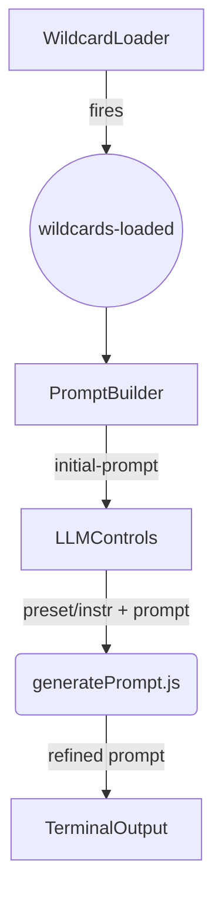

# Project [ConquestAce](http://www.conquestace.com/)
conquestace.com is a glitch-aesthetic playground for AI-assisted creativity. This repo houses the prompt-builder and terminal UI that power the site.
## Features
1. [Index](#index)
2. [newtab](#newtab)
3. [TerminalOverlay](#terminaloverlay)
4. [Wildcarder](#wildcarder)

## Index
The landing page of Project ConquestAce. It immediately sets the glitch‑aesthetic tone for the entire site and funnels visitors to each major tool.

- Animated headline built with a staggered text‑scramble effect.

- Quick‑link grid to newtab, TerminalOverlay, Wildcarder, and the blog.

- Source ➜ src/pages/index.astro


➡️ Source: [`src/pages/index.astro`](./src/pages/index.astro)
## newtab

A self‑contained **custom start page** inspired by minimal command launchers (Surfraw, DuckDuckGo bangs):

| Capability                | Notes                                                                                |
| ------------------------- | ------------------------------------------------------------------------------------ |
| **Glitch Tiger backdrop** | SVG/PNG asset positioned as a floating element with subtle parallax.                 |
| **Command parsing**       | `g query` → Google, `ddg query` → DuckDuckGo, aliases in `tablogic.js`.              |
| **Keyboard‑first UX**     | Page autofocuses the input; *⌘/Ctrl+L* cycles history, *Esc* clears.                 |
| **Live clock**            | Optional; update interval 1 s.                                                       |
| **Config object**         | Users can adjust defaults (engine, colors, showClock) via `CONFIG` in `tablogic.js`. |

Source ➜ [`src/pages/newtab.astro`](./src/pages/newtab.astro) + [`src/scripts/tablogic.js`](./src/scripts/tablogic.js)

---

## TerminalOverlay

A full‑screen **AI terminal interface** that responds in cryptic, hacker‑style prose.

- **OpenUI Gemma‑3** primary LLM (via `/api/chat/completions`).
- **Gemini 2 Flash** fallback after 5 s timeout.
- **Streaming output** rendered with a faux CRT scan‑line effect, cursor blink, and occasional *ASCII corruption*.
- Accepts site navigation commands (`help`, `goto /wildcarder`, etc.) and forwards unknown input to the LLM.
- Source ➜ [`src/components/TerminalOverlay.astro`](./src/components/TerminalOverlay.astro)

## Wildcarder 🃏 — Prompt-Builder UI

A lightweight (lol) Astro page (and supporting islands/functions) for turning **wildcard text files** into refined LLM prompts.

---

## ✨ Key Features

| Module                                | What it does                                                                                                                                                                                                                                                                                                                                                                                                                                                                                                                            |
| ------------------------------------- | --------------------------------------------------------------------------------------------------------------------------------------------------------------------------------------------------------------------------------------------------------------------------------------------------------------------------------------------------------------------------------------------------------------------------------------------------------------------------------------------------------------------------------------- |
| `WildcardLoader.astro`                | *Client-only island* that lets users<br>• **Drag-and-drop or browse** `.txt` wildcard files.<br>• **Load defaults** from our Hugging Face dataset (Danbooru / Natural-language).<br>• Cherry-pick at three levels:<br>  1️⃣ Collection (Danbooru vs NL) <br>  2️⃣ **Category pills** (e.g. `clothing`, `styles`)<br>  3️⃣ **File pills** that **wrap onto new lines** when they overflow.<br>• Remove individual files 🗑️ or **“🧹 Clear wildcards”**. <br>• Emits `wildcards-loaded` events (the working set) for downstream islands. |
| `PromptBuilder.astro`                 | Generates an **initial prompt** by randomly sampling lines from the selected wildcard files.  Users can “🔄 Re-roll”, edit the prompt, and then broadcast it via `initial-prompt`.                                                                                                                                                                                                                                                                                                                                                      |
| `LLMControls.astro`                   | UI for optional **extra instructions** and **system-prompt preset** (Danbooru, NL, etc.).  Sends everything to the serverless endpoint.                                                                                                                                                                                                                                                                                                                                                                                                 |
| `netlify/functions/generatePrompt.js` | • Per-preset **system prompts** (extensible via `SYSTEM_PRESETS`).<br>• **OpenAI Moderation** gate with per-category probability thresholds (sensitive & questionable allowed, explicit blocked).<br>• Primary call → **Gemma-3 on OpenUI**; fallback → **Gemini 2 Flash**.                                                                                                                                                                                                                                                             |

---

## 🏗️ How It Works



1. **Wildcard ingestion**
   *User uploads files or clicks “Load defaults”.* Loader pulls manifests from
   `https://huggingface.co/datasets/ConquestAce/wildcards/...`, letting the user
   toggle **categories** (pills) and **individual files** (pills that wrap).

2. **Prompt building**
   PromptBuilder samples **N lines / file** (user-configurable), assembles an
   initial prompt, shows it in a textarea, and dispatches it.

3. **LLM call**
   LLMControls collects:

   * `initialPrompt` (from above)
   * `preset` (Danbooru / Natural-language / future)
   * `instructions` (free-form)
     → POSTs to `/generatePrompt`.

4. **Safety & refinement**
   Serverless function runs the OpenAI **/moderations** API.
   *Categories & thresholds* are editable in one object.
   Clean prompts flow to Gemma-3; fallback to Gemini Flash.
   Response is streamed back to the terminal.

---

## 🔧 Configuration Pointers

| What to change                         | Where                                                                                                       |
| -------------------------------------- | ----------------------------------------------------------------------------------------------------------- |
| **Add a new wildcard collection**      | Upload `.txt` files + manifest to HF, then extend `collectionSelector` (if new top-level) and/or manifests. |
| **Add a new system-prompt preset**     | Add key in `SYSTEM_PRESETS` and a `<option>` in `LLMControls.astro`.                                        |
| **Adjust moderation strictness**       | Edit `BLOCK_THRESHOLDS` in `generatePrompt.js`.                                                             |
| **Tweak UI colors / Tailwind classes** | Modify the class strings in the `.astro` components.                                                        |

---

## 🚀 Quick Start

```bash
# Install deps
npm i
# Run Astro dev server
npm run dev
# Netlify Functions locally (via netlify-cli)
netlify dev
```

Set the following environment variables:

* `OUI_API_KEY` – OpenUI Gemma-3 endpoint
* `GEMINI_API_KEY` – Google Generative AI
* `OPENAI_API_KEY` – for moderation calls

---

## 🤝 Credits

* **Wildcard dataset** hosted at [https://huggingface.co/datasets/ConquestAce/wildcards](https://huggingface.co/datasets/ConquestAce/wildcards).
* Gemma-3 served via **OpenUI** .
* Backup model: **Gemini 2 Flash**.
* Moderation powered by **OpenAI** `/moderations` endpoint.

Enjoy building refined prompts without ever exposing sensitive wildcard files to the LLM!

## Contributing
Pull requests are welcome! See [CONTRIBUTING.md](CONTRIBUTING.md).

## License
Credit me if you want, or dont. I vibe coded all of this, but still took plently of time. Currently at 100 hours of my time :) © 2025 Ashiful Bhuiyan
